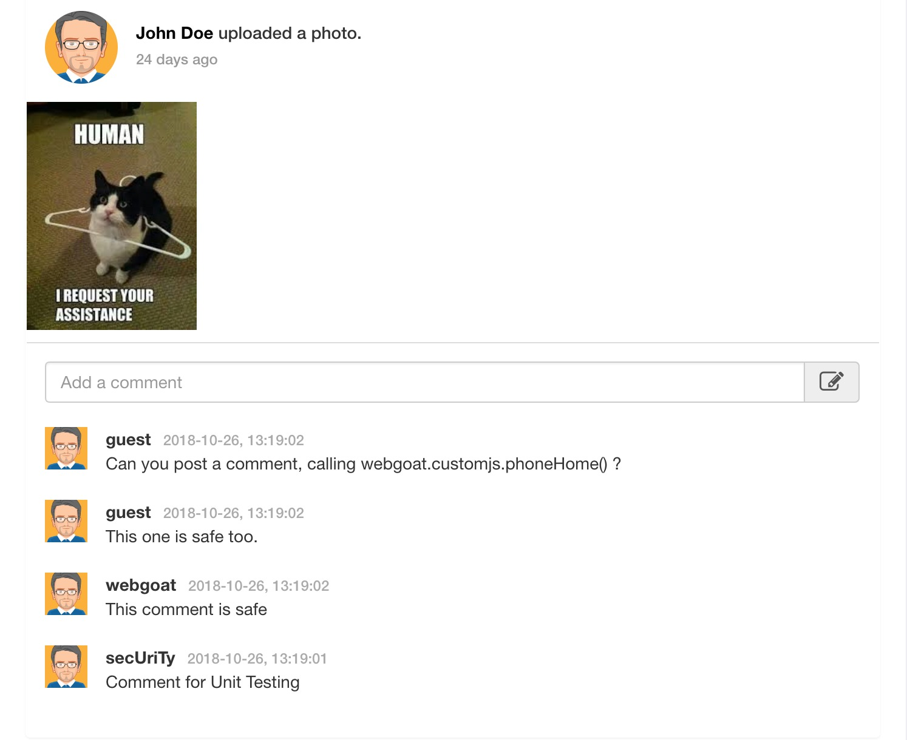
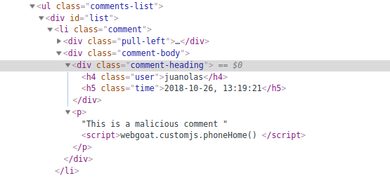

# Lesson 13
XSS
## Challenge

> See the comments below.
\
> Add a comment with a javascript payload. Again …​ you want to call the webgoat.customjs.phoneHome function.\
> As an attacker (offensive security), keep in mind that most apps are not going to have such a straight-forwardly named compromise. Also, you may have to find a way to load your own javascript dynamically to fully achieve goals of exfiltrating data.

## Solution

This DOM-based XSS attack consists of writing a malicious commment which will execute a script everytime the comments webpage is loaded.

If we type whatvever comment we like and add the following code to it: ``, the phoneHome function will be called.

We can see in the next images the comment we introduced and the comment that the page shows to all users.

Comment code | Comment shown
------------ | -------------
 | 

When we refresh the page, the script is executed and gives the following output in the browser's console.

 

## How to prevent this attack

You should allways take into account one rule: NEVER trust data that comes from users or any other external source. Any data must be validated or escaped for his output.

We can talk about three ways to prevent XSS attacks:

-data validation: It's the process of ensuring that your application analize the correct type of data and preventing malicious or any other kind of data from doing harm to the site, databse or users. It is usually used to prevent SQL injection attacks but can also be used to prevent XSS attacks.

-data sanitization: The data sanitization focuses on manipulating the data to ensure that it is safe, eliminating any undesirable part and putting them in the correct way. It is a strong way to prevent XSS attacks but must never be used alone. It is usualy used with data validation.

-output escaping: Taking data an application has received and ensuring it's secure before renderingit for the end user. 
This prevents the browser from misunderstand any special characters.

